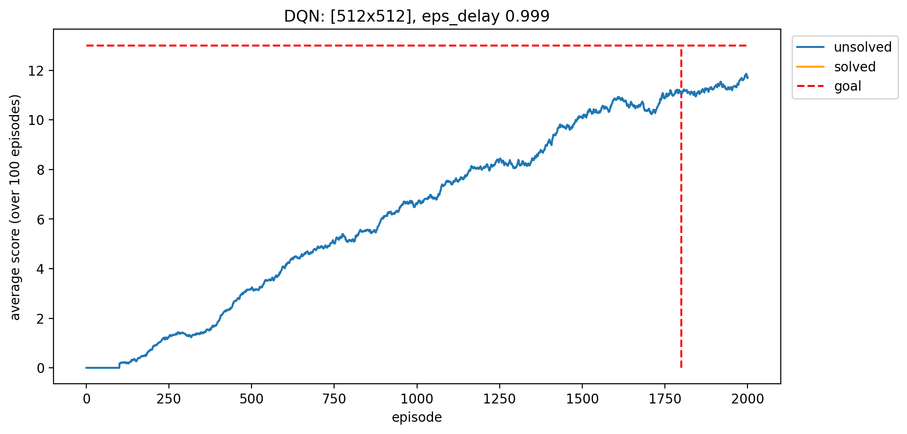
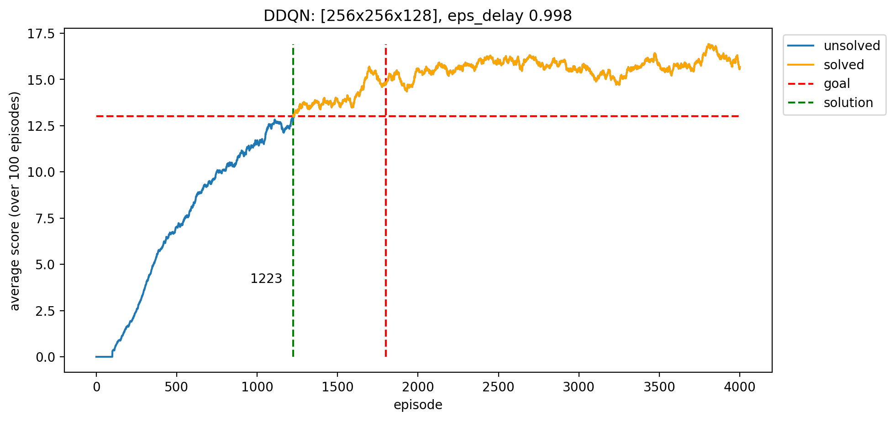

# Unity banana collector

Training agents using deep reinforcement learning for the banana collector environment from the [Unity Machine Learning Agents Toolkit](https://github.com/Unity-Technologies/ml-agents). There are two versions of the environment, the state-based and the pixel-based environment. They only differ in their coding of the state space (see below).

## Learning task

Goal: 
- collect as many yellow bananas as possible

State space (state-based):
- `Box(1)` dimension of agent's velocity
- `Box(36)` dimensions of local ray-cast perception on nearby objects

State space (pixel-based):
- `Box(84,84,3)` RGB image of the agent's first person view of the environment

Actions: 
- `Discrete(4)` forward, backward, left, right

Rewards: 
- +1 for yellow banana
- -1 for blue banana

The agent solves the environment when it achieves a +13 average score over 100 episodes.

## Training the agent

All code for training is in [training.py](./src/training.py). You can execute the code as shown in this [notebook](./training.ipynb) to train an agent for the state-based environment.

## Learning algorithms

Experiments have been run using the code in this repository (see [script_train_state.py](./script_train_state.py)) to generate results for deep q-networks with or without the improvement through double q-learning [Van Hasselt et al., 2015], with different network architectures and varying epsilon-decay.

The underlying neural network is a feedforward neural network, implemented in PyTorch, with a *n* hidden layers of varying width (by default, 2 hidden layers of 512 units each) using the ReLU activation function, the implementation is found in [model.py](.src/model.py). 

The agent is trained using the DQN model as described by Mnih et al. [2015], with a replay buffer of size 100,000 which is sampled every 4 time steps with a batch size of 64. The discount rate for future rewards is 0.99. The neural network is optimized using the Adam optimizer [Kingma et al., 2014] and a learning rate of 0.0005. The parameters are updated softly with an interpolation parameter of 0.001. Double q-learning is implemented as described by Van Hasselt et al. [2015], using the local Q-network for choosing actions and the target Q-network for evaluating these actions. Details about the training of the DQN-based agent are found in [agent.py](./src/agent.py). 

The resulting network weights of each model that learned a solution to the environment are saved in [src/params/](./src/params/). The corresponding score arrays and plots are saved in [assets](./assets/). Each of those agents can be loaded and tested as described in this [notebook](./demo.ipynb).

## Experiments for state-based environment

Experiments have been run using the code in this repository (see [script_train_state.py](./script_train_state.py)) to generate results for deep q-networks with or without the improvement through double q-learning, with different network architectures and varying epsilon-decay.

The experiments are summarized in the following table:

Learning algorithm | Network architecture | Epsilon decay | Episodes until solution
--- | --- | --- | ---
DQN | 512x512 | 0.999 | no solution
DDQN | 512x512x128 | 0.998 | 1752
DDQN | 512x512 | 0.997 | 1226
DDQN | 256x256x128 | 0.998 | 1223
DDQN | 512x256x128 | 0.998 | 1196

The "naïve" implementation of a simple DQN with 2 hidden layers, each with 512 units resulted in the following performance shown in the following plot, showing the scores (averaged over past 100 episodes) over the course of training the agent for 2000 episodes. The horizontal red dashed line shows the goal average score of +13. The vertical red dashed line shows the goal of learning a policy to solve the environment within the first 1800 episodes. 

Despite not reaching the desired performance during training, the average reward over 100 episodes exceeds +13 when testing the trained agent. This is likely because of the epsilon-greedy action selection during training. Even after 2000 episodes of training, the agent still chooses random actions with a probability of 0.999^2000=13.52%. Reducing the epsilon decay from 0.999 to 0.998 reduces the probability of choosing random actions after 2000 episodes to just 0.998^2000=1.82%. This is much closer to a greedy policy which will exploit the found policy more and thus lead to higher average scores during training. 

Aside from tuning the epsilon decay, subsequent experiments also use double q-learning [Van Hasselt et al., 2015]. The network architecture has been varied to include deeper networks (512x512x128) as well as deeper, yet narrower, networks (256x256x128). The best three solutions, shown in the bottom three rows of the table above, perform very similarly. Considering the stochastic nature of neural network training, it can be claimed that the performance difference between these three setups are negligible. In order to reduce training time and model complexity, one may choose the network architecture of 256x256x128 (108,288 network weights) over the 512x512 (283,136 weights) and 512x256x128 (183,296 weights) architectures. The performance of this network is shown below:

## Further work

In order to further improve the learning agent in this environment, the goals are manifold. One can aim to (1) achieve better performance within the first *n* training episodes, (2) speed up training, or (3) reduce the model size complexity. As such, it would be possible to implement a variety of proposed DQN improvements to speed up training and improve performance, such as:
- implement prioritized experience replay [Schaul et al., ICLR 2016]
- implement noisynets [Fortunato et al., ICLR 2018]

Moreover, to reduce the model size and complexity, it would be advantageous to simplify the neural network architecture, hence reducing the number of model parameters as much as possible. This will lead to faster training, faster prediction (forward pass through the network) and a network less prone to overfitting. It is possible to run a more extensive search over the space of architectures as well as other hyperparameters, to jointly optimize them, either through an extensive grid search or a random search.
